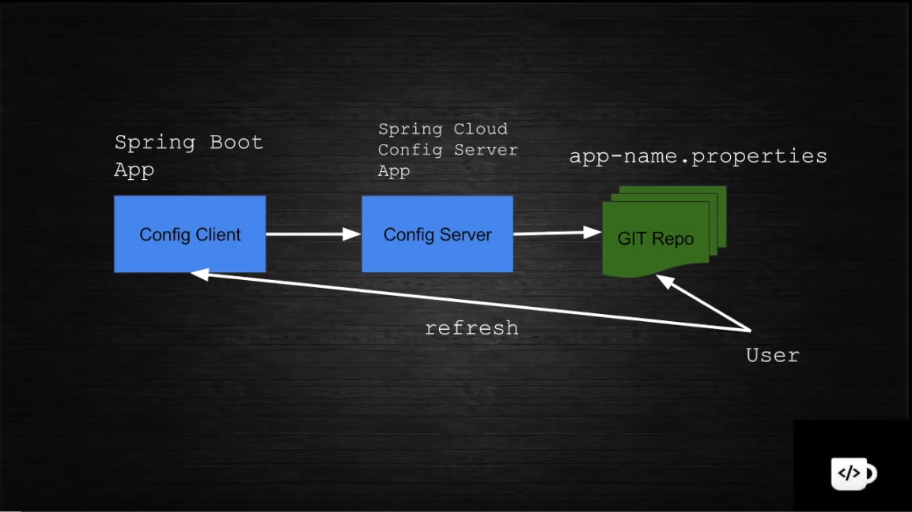

### Spring cloud config

  - Config của các microservice sẽ được lưu trong 1 git repository. Mỗi khi có thay đổi về config chúng ta không cần phải redeploy lại server và chỉ cần gọi api refresh đến "Config client" server. Sau khi gọi api refresh thì, "Config client" server sẽ gọi đến "Config Server" server để lấy lại config từ git repository.
  - Reference: https://www.youtube.com/watch?v=b2ih5RCuxTM, http://javaonfly.blogspot.com/2017/06/microservicespring-cloud-config-server.html.
  
### Design microservice với spring cloud

