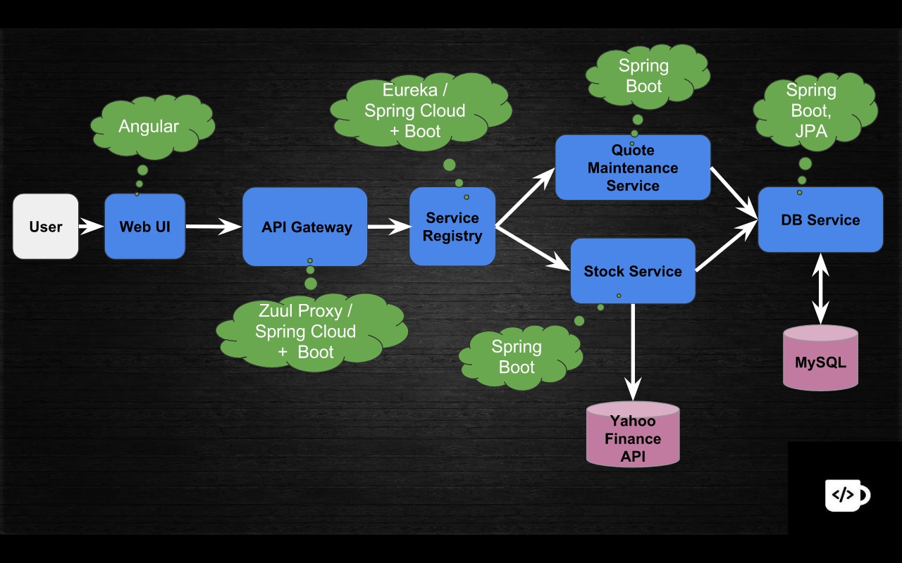

### Spring cloud config

  - Config của các microservice sẽ được lưu trong 1 git repository. Mỗi khi có thay đổi về config chúng ta không cần phải redeploy lại server và chỉ cần gọi api refresh đến "Config client" server. Sau khi gọi api refresh thì, "Config client" server sẽ gọi đến "Config Server" server để lấy lại config từ git repository.
  - Reference: https://www.youtube.com/watch?v=b2ih5RCuxTM, http://javaonfly.blogspot.com/2017/06/microservicespring-cloud-config-server.html.
  
### Design microservice với spring cloud

#### Xây dựng service registry với Spring cloud và Eureka
  - Các microservice sẽ đăng ký với service registry. Sau khi đã đăng ký với service registry, các microservice có thể gọi qua nhau mà không cần phải gọi đến microservice khác thông qua ip mà chỉ cần gọi qua tên của microservice đó đã đăng ký với service registry. Service registry cũng quản lý trạng thái của từng instance của mỗi microservice đã đăng ký với service registry.

#### Xây dựng microservice

#### Xây dựng API gateway

#### Xây dựng Load balancer

