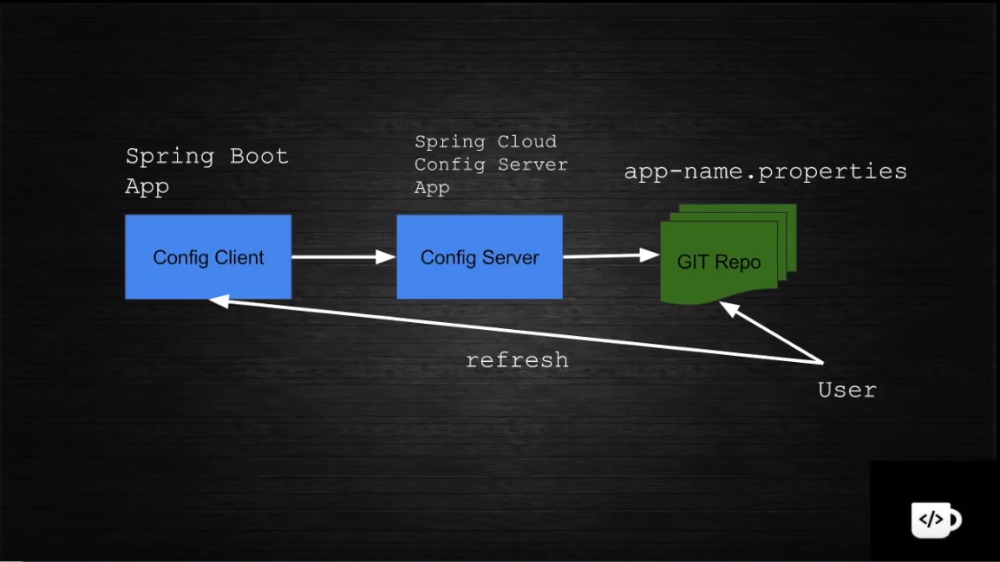
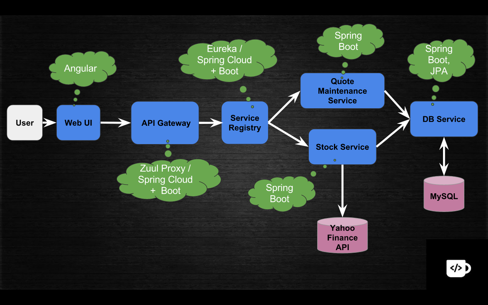

### Spring Cloud Config

  - Config của các Microservices("Config client" service) sẽ được lưu trong 1 git repository. Mỗi khi có thay đổi về config chúng ta không cần phải redeploy lại service và chỉ cần gọi api refresh đến "Config client" service. Sau khi gọi api refresh thì, "Config client" service sẽ gọi đến "Config Server" service để lấy lại config từ git repository.
  - Reference: https://www.youtube.com/watch?v=b2ih5RCuxTM, http://javaonfly.blogspot.com/2017/06/microservicespring-cloud-config-server.html.
  
### Design Microservice(MS) với Spring Cloud

#### Xây dựng Service Registry(SR) với Spring Cloud và Eureka
  - Các MS sẽ đăng ký với SR. Sau khi đã đăng ký với SR, các MS có thể gọi qua nhau mà không cần phải gọi đến MS khác thông qua ip mà chỉ cần gọi qua tên của MS đó đã đăng ký với SR. SR cũng quản lý trạng thái của từng instance của mỗi MS đã đăng ký với SR.
  - Reference: 

#### Xây dựng MS
  - Các MS như DB service, Stock service được xây dựng bằng Spring boot và được cấu hình để đăng ký với SR.

#### Xây dựng API gateway
  - App FE sẽ không gọi API trực tiếp đến các MS mà sẽ gọi qua API gateway. API gateway sẽ chịu trách nhiệm điều hướng API đến với MS thích hợp.

#### Xây dựng Load balancer với Ribbon client
  - Một MS có thể có nhiều instance nên chúng ra cần xây dựng load balancer cho các instance của cùng 1 MS. Load balancer có thể đặt trong SR hoặc đặt trong 1 MS nào đó. Nhưng không nên đặt load balancer ở trong SR vì có thể khiến SR quá tải. 

#### Đơn giản hóa việc gọi API giữa các MS với Feign client
  - 

#### Reference
  - Chúng ta có thể xây dựng 1 ứng dụng đầy đủ bao gồm các microservices, service registry, API gateway... dựa vào turtorial dưới đây  https://www.youtube.com/watch?v=rlS9eH5tEnY, https://www.youtube.com/watch?v=ifBFwH59gGA.
  - Ngoài ra có thể tham khảo tài liệu ở các link sau:
    http://javaonfly.blogspot.com/2017/09/deep-dive-to-distributed-service.html
    http://javaonfly.blogspot.com/2017/07/microservicespring-cloud-eureka-server.html
    http://javaonfly.blogspot.com/2017/07/microservicescommunication.html
    http://javaonfly.blogspot.com/2017/08/microservices-communication-zuul-api.html
    http://javaonfly.blogspot.com/2017/08/microservices-tutorial-ribbon-as-load.html
    http://javaonfly.blogspot.com/2017/07/microservices-communication-feign-as.html
    

